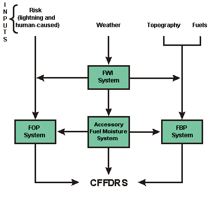

## 
计算加拿大森林火险气候指数系统 

 
 
图1

 
 
图2

计算FWI指数如2所示，FWI依赖于ISI和BUI指数，ISI依赖于FFMC，BUI依赖于DMC和DC，需提供以下参数：
 

1、温度

2、相对湿度

3、风速

4、降雨量

计算FFMC需提供以下参数：
<b>

ffmc_yda:   The Fine Fuel Moisture Code from previous iteration 上一次迭代的FFMC，默认启动值是85

temp:   Temperature (centigrade) 温度

rh:   Relative Humidity (%) 相对湿度

prec:   Precipitation (mm) 降雨量

ws:   Wind speed (km/h) 风速
</b>

